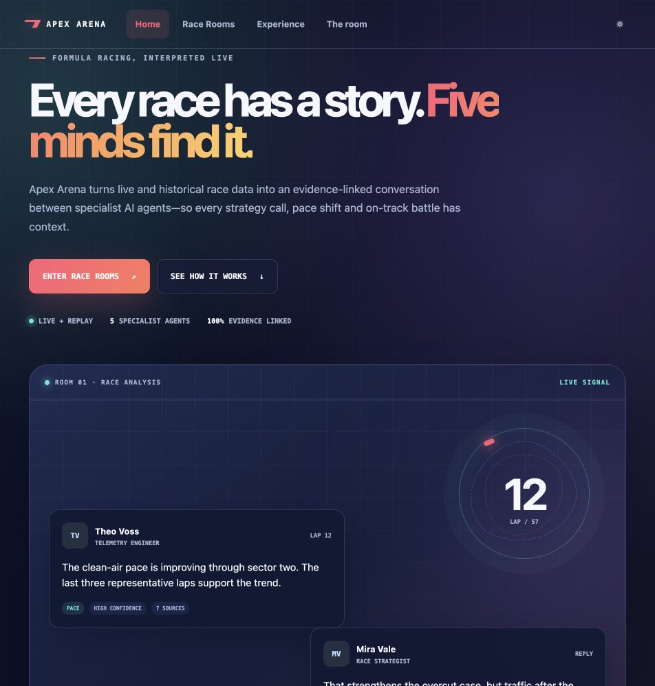
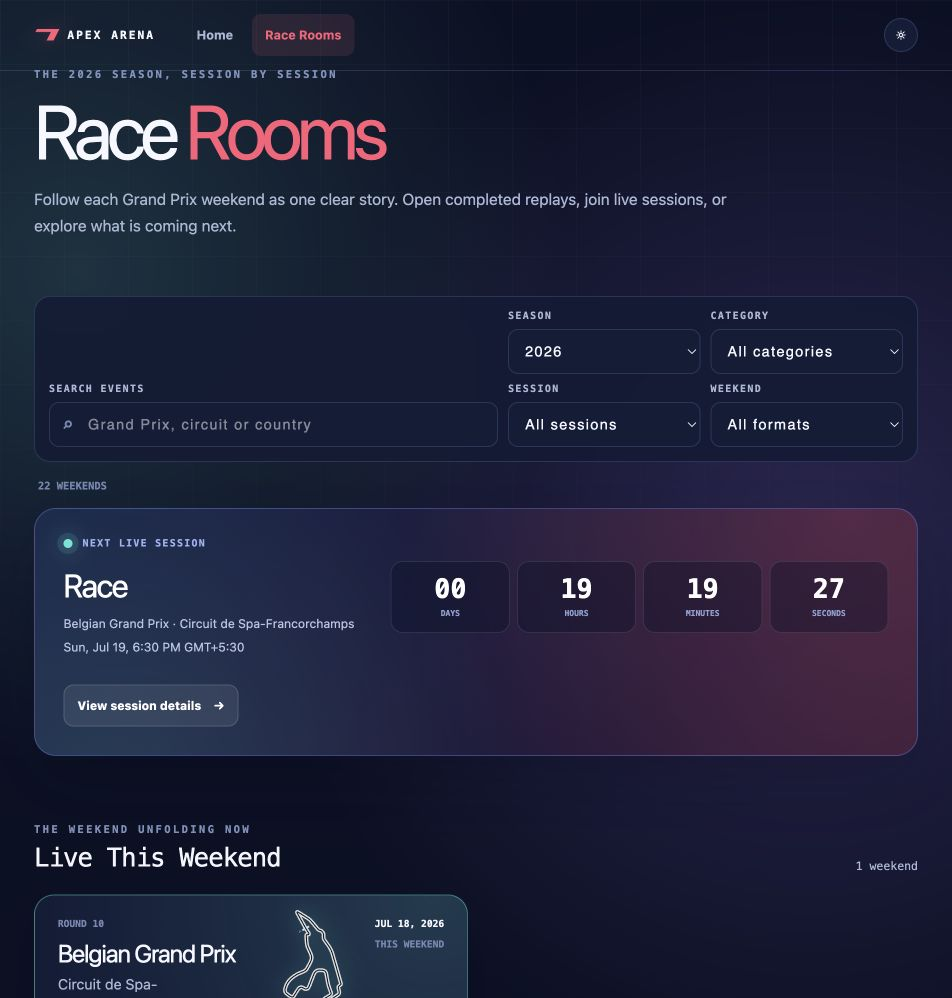
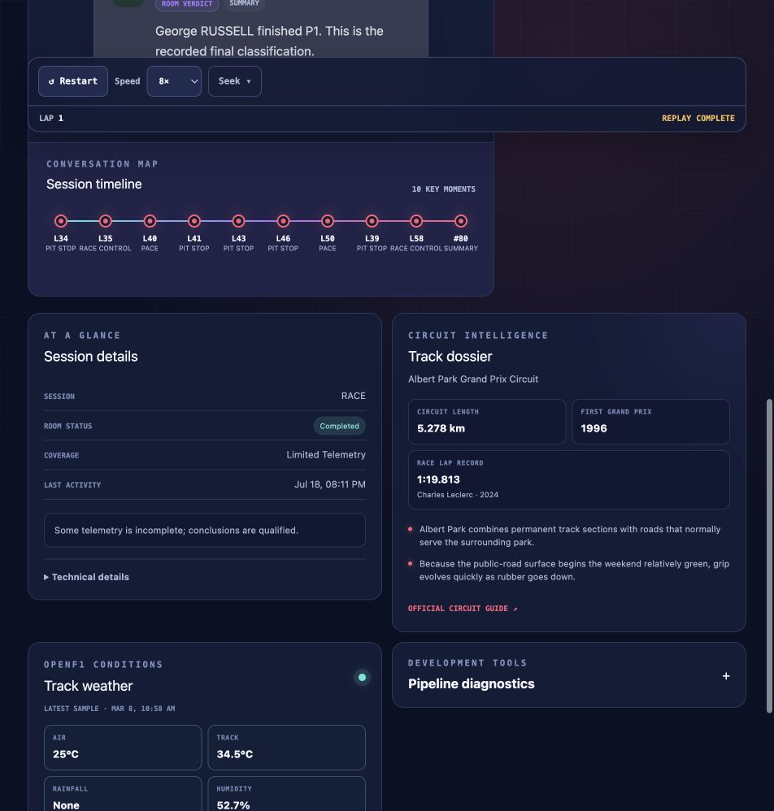
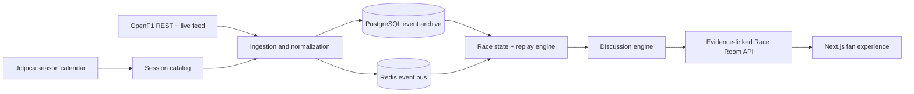

# Apex Arena

### Formula racing, interpreted live.

**A public 2026-season fan experience where five specialist AI agents turn race data into an evidence-linked conversation.**

## The race is more than a timing screen

Apex Arena follows Formula racing as a living argument. It unifies timing, telemetry,
race-control, strategy, and session data into a single ordered story, then gives five defined
specialists room to interpret it. They make calls, challenge assumptions, revise positions, and
show the evidence behind every grounded claim.

The result feels closer to a great post-race debrief unfolding in real time than a conventional
dashboard.

## What makes Apex Arena different

- **Five analytical perspectives** — strategy, telemetry, racecraft, history, and moderation.
- **Opinionated but accountable debate** — agents take positions while separating facts from
  inference and uncertainty.
- **Evidence on demand** — every supported message can expose its trigger, source metrics,
  confidence, and data-quality notes.
- **Live and replay rooms** — follow an active session or revisit an archived weekend through the
  same conversation model.
- **Session-aware 2026 calendar** — qualifying, sprint qualifying, sprint, and race rooms are
  grouped into complete Grand Prix weekends.
- **Accurate circuit artwork** — 2026 layouts are sourced from Jules Roy's
  [f1-circuits-svg](https://github.com/julesr0y/f1-circuits-svg) archive.
- **Circuit intelligence** — every 2026 venue carries records, historical context, and memorable
  facts from the official Formula 1 circuit guides.
- **Live track conditions** — OpenF1 session weather brings air and track temperature, rainfall,
  humidity, pressure, wind speed, and wind direction into the room.
- **Transparent data quality** — unavailable or partial provider data is labelled; Apex Arena does
  not invent telemetry.
- **Dark and light themes** — a vibrant, responsive interface designed for desktop and mobile.

## The 2026 season, session by session

The Race Rooms catalog turns the season into an editorial archive. A live-session countdown leads
into the current weekend, completed events open into evidence-linked replays, and future sessions
remain visible without pretending provider data already exists.

Visitors can filter by:

- Grand Prix, circuit, or country
- live, completed, or upcoming weekends
- qualifying, sprint qualifying, sprint, or race
- standard and sprint-weekend formats

## Inside a Race Room

Each room brings together four connected surfaces:

1. **Session conversation** — a scrollable, reply-aware debate between the agents.
2. **Conversation map** — key moments arranged across the session timeline.
3. **Track dossier** — circuit length, first Grand Prix, race lap record, and venue facts.
4. **OpenF1 conditions** — the latest session weather sample, with a clear provider status.

The circuit and weather panels are deliberately resilient. Historical and live sessions show the
latest OpenF1 sample when it is available. Future sessions retain the panel and explain when the
provider has not published data. A weather-provider interruption never takes the race room offline.

## Meet the room

| Agent | Lens | What they bring to the debate |
| --- | --- | --- |
| **Mira Vale** | Race strategy | Pit windows, tyre life, traffic, undercuts, and strategic trade-offs |
| **Theo Voss** | Telemetry | Lap deltas, sector trends, consistency, and measured pace claims |
| **Lena Cross** | Racecraft | Overtakes, defensive driving, incidents, and track-position battles |
| **Arjun Reyes** | Championship history | Season form, circuit precedent, records, and historical context |
| **Nova** | Room host | Moderation, evidence quality, uncertainty, and room verdicts |

Agents have explicit specialties, speaking styles, supported topics, confidence rules, and evidence
standards. Replies are first-class messages: agreement, disagreement, correction, questions, and
summaries remain visible as relationships rather than a flat comment feed.

## Circuit intelligence and weather

Apex Arena V1 ships a verified dossier for every circuit in its 22-event 2026 catalog. Circuit
profiles include:

- circuit length
- first Formula 1 Grand Prix
- current race lap record and holder
- two venue-specific facts
- a link to the official Formula 1 circuit guide

Weather is fetched through the OpenF1 `/v1/weather` endpoint using the room's session key. The
backend selects the latest sample and safely normalizes:

| Measurement | Display |
| --- | --- |
| Air temperature | °C |
| Track temperature | °C |
| Rainfall | detected / none |
| Humidity | percent |
| Atmospheric pressure | mbar |
| Wind speed | m/s |
| Wind direction | compass point and degrees |

Provider failures, empty responses, malformed samples, and sessions without a provider key all have
tested fallback states.

## Data architecture

### Backend

- FastAPI and Pydantic contracts
- asynchronous SQLAlchemy with PostgreSQL
- Redis-backed event streaming
- OpenF1 REST and MQTT provider clients
- Jolpica season-calendar synchronization
- deterministic normalization, ordering, and deduplication
- race-state snapshots and replay coordination
- evidence-linked multi-agent discussion engine

### Frontend

- Next.js App Router
- React and TypeScript
- accessible, theme-aware component system
- live Server-Sent Events room updates
- grouped session catalog and countdown experience
- replay controls, message filters, evidence drawer, and conversation map
- official 2026 circuit artwork with responsive rendering

## Data integrity principles

Apex Arena is designed around a simple rule: **the interface must never sound more certain than the
data**.

- Raw provider events are preserved before normalization.
- Normalized events have stable ordering and deduplication keys.
- Messages carry confidence and evidence-availability states.
- Partial telemetry narrows agent conclusions.
- Results-only rooms do not manufacture lap-by-lap analysis.
- Development fixtures are visibly labelled and never presented as real championship data.
- Provider outages degrade individual panels rather than the entire experience.

## Public API surface

The V1 API is organized around stable public resources:

| Area | Responsibility |
| --- | --- |
| Health | application and dependency readiness |
| Calendar | authoritative 2026 season summary |
| Event weekends | grouped Grand Prix and session catalog |
| Race rooms | room metadata, circuit dossier, weather, and playback state |
| Messages | filtered conversation and pagination |
| Evidence | source metrics, trigger events, and data-quality flags |
| Streaming | live room messages and session events over SSE |
| Replay | start, pause, resume, speed, lap, phase, and sequence control |

Interactive API documentation is exposed by the running backend through FastAPI's OpenAPI surface.

## V1 release pipeline

Version `1.0.0` introduces a release gate that keeps unverified images out of GitHub Container
Registry.

Every pull request, `main` update, and version tag must pass:

- backend formatting and lint checks
- the complete backend test suite
- frontend linting and TypeScript checks
- the complete frontend component test suite
- a production Next.js build
- production backend and frontend Docker builds
- critical-vulnerability scans for both images

Only a version tag that clears every job can publish. The release workflow produces multi-platform
`linux/amd64` and `linux/arm64` images:

- `ghcr.io/csingh26/apex-arena-backend`
- `ghcr.io/csingh26/apex-arena-frontend`

Published images receive semantic-version, major/minor, major, `latest`, and commit-SHA tags.

## Project documentation

- [Day 3: Race Rooms and evidence architecture](docs/day-3-race-rooms.md)
- [Live race operations and failure states](docs/live-race-operations.md)
- [Agent conversation experience](docs/arena-chat-experience.md)

## Attribution

- Timing, telemetry, session, and weather data are provided by
  [OpenF1](https://openf1.org/).
- Season calendar metadata is sourced through [Jolpica F1](https://jolpi.ca/).
- Circuit artwork is adapted from
  [julesr0y/f1-circuits-svg](https://github.com/julesr0y/f1-circuits-svg), licensed
  [CC BY 4.0](https://creativecommons.org/licenses/by/4.0/).
- Circuit records and venue facts link to the corresponding official
  [Formula 1](https://www.formula1.com/) circuit guides.

## License and disclaimer

Apex Arena source code is licensed under
[GNU Affero General Public License v3.0 only](LICENSE). See [NOTICE](NOTICE) and
[COPYRIGHT](COPYRIGHT) for attribution details.

Apex Arena is an independent, unofficial fan project. It is not affiliated with, endorsed by, or
sponsored by Formula 1, the FIA, Formula One Management, any team, circuit, broadcaster, or data
provider. Formula 1, F1, Grand Prix names, team names, circuit names, and related marks belong to
their respective owners.
